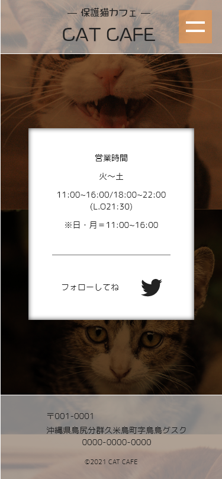
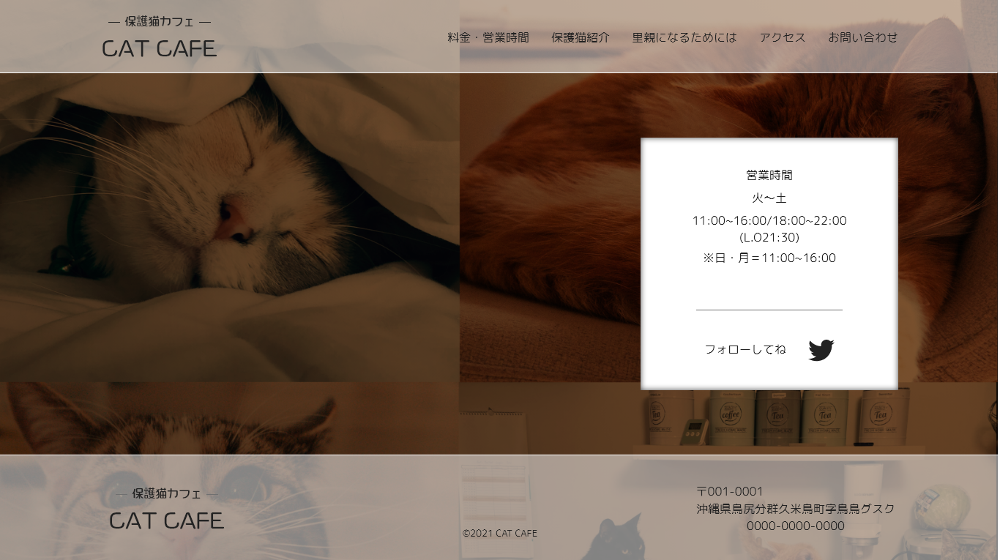
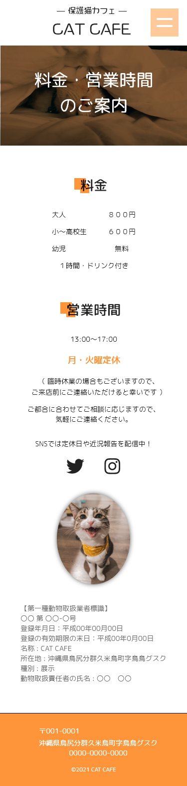
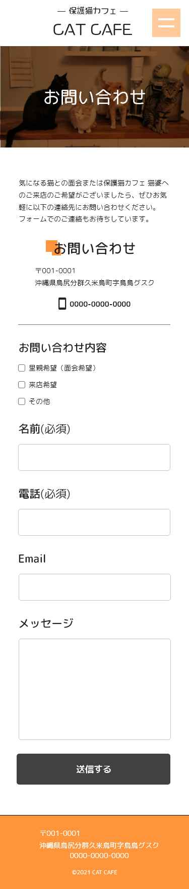
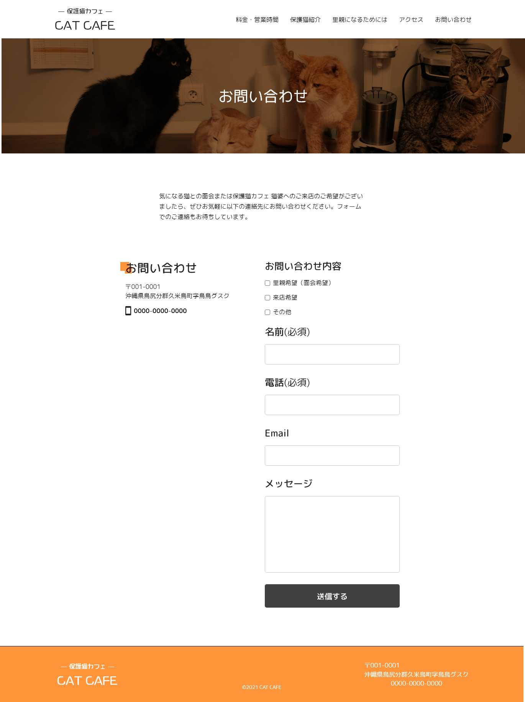
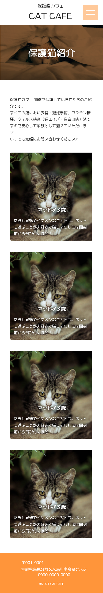
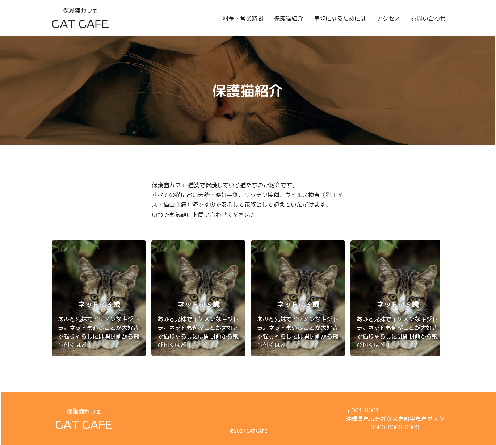

<!-- AUTO-GENERATED-CONTENT:START (STARTER) -->
<h1 align="center">
   Fictitious site
</h1>

This site is designed to look like a fictional site This site is designed to look like.

## Image Gallery

1.  **Top Page**

    

    

2.  **About Page**

3.  **Contact Page**

    

    

4.  **Cat Page**

    

	

## Description

This site is created with WordPress.
Some parts of this site are arranged in a Gutenberg block style design.
## What's inside?

A quick look at the top-level files and directories you'll see in a WordPress project.

    .
    ├── images
    ├── editor-style.css
    ├── footer.php
    ├── front-page.php
    ├── function.php
    ├── header.php
    ├── home.php
    ├── index.php
    ├── mystyle.js
    ├── README.md
    ├── screenshot.jpg
	├── style-both.css
	├── style.css
    └── script.js

<!-- AUTO-GENERATED-CONTENT:END -->
